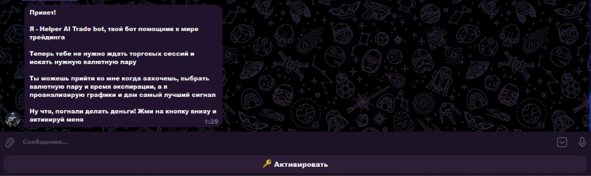
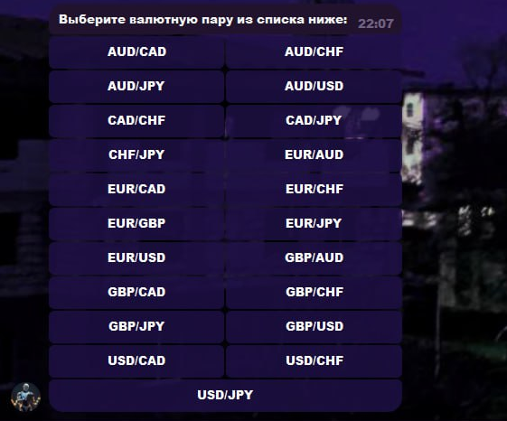
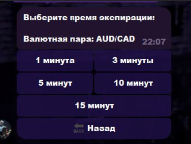
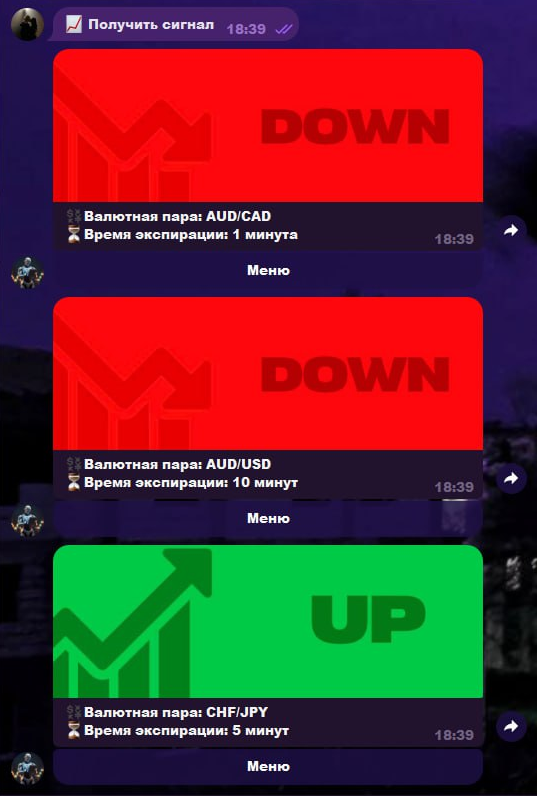

# Telegram-бот: торговые сигналы по валютным парам

> **Публикация:** открытое описание кейса; **исходный код в этом репозитории не выкладывается** (коммерческий заказ). Ниже — суть продукта и стек без раскрытия конфиденциальных данных заказчика.

## Кратко

Telegram-бот для выдачи **торговых сигналов** (направление UP/DOWN) по выбранной **валютной паре** и **экспирации**. Пользователь проходит **онбординг** с привязкой к партнёрской воронке брокера, далее получает сигналы с учётом **лимитов** и **технических индикаторов** на стороне сервиса. Взаимодействие с внешним миром — через **API и HTTP** (см. ниже).

## API и интеграции

- **Telegram Bot API** — клиент на **aiogram 3** (команды, callback, FSM, медиа).
- **Pocket Option — affiliate / partner API** — асинхронный **HTTP-клиент** (`aiohttp`): проверки и сценарии доступа в партнёрской воронке, подпись запросов, работа с базовыми URL из конфигурации.
- **Слой рыночных данных** — **мультипровайдерная** схема с единым контрактом: подключение источников через **асинхронные клиенты** и возможность смены поставщика без переписывания бота; в кодовой базе заложены адаптеры под **внешние REST API** котировок (переключение и ключи — в конфигурации окружения).
- Дополнительно: **httpx** / **aiohttp** для исходящих запросов к внешним сервисам по мере необходимости.

## Что сделано

- Сценарии **регистрации / проверки доступа**, админ-функции, клавиатуры под список пар и таймфреймов (в т.ч. доработка сетки пар и кнопок экспираций по запросу заказчика).
- **Генерация сигнала** на основе набора индикаторов (в проекте: MA/EMA, RSI, MACD и связанная логика на `pandas`).
- **Слой данных**: **API-совместимая** архитектура провайдеров котировок (подмена источника через конфиг/код), кэш и переподключение при сетевых сбоях.
- **Устойчивость**: доработки под **сохранение доступа** (переход на хранение в БД вместо «однодневной» активации), обработка **обрывов сети** и переподключение провайдера.
- **Учёт режима рынка**: проверка **выходных** (когда котировки недоступны), чтобы не выдавать сигналы «в пустоту».
- **Эксплуатация**: деплой на **VPS заказчика**, systemd-сервис, скрипты развёртывания; сопровождение после сдачи (правки по согласованию).

## Технологии

| Категория | Стек |
|-----------|------|
| Язык | Python 3 |
| Telegram | aiogram 3.x |
| Данные / индикаторы | pandas, pandas-ta-classic |
| БД | SQLite, SQLAlchemy 2 |
| HTTP / API | aiohttp, httpx; REST-интеграции (в т.ч. affiliate API брокера) |
| Конфигурация | python-dotenv |
| Тесты | pytest, pytest-asyncio |
| Инфраструктура | Linux VPS, systemd, bash-деплой |

## Роль и формат работы

Заказ с фриланс-площадки: **разработка по ТЗ**, выкладка на сервер заказчика, **итеративные доработки** по обратной связи (доступы, сеть, UX клавиатур, пограничные случаи по расписанию рынка).

## Скриншоты интерфейса

| Шаг | Описание |
|-----|----------|
| 1 | Приветствие, CTA «Активировать» |
| 2 | Онбординг: регистрация у брокера, проверка |
| 3 | Ввод ID аккаунта, проверка, пополнение |
| 4 | Выбор валютной пары (сетка, последняя пара — крупная кнопка) |
| 5 | Выбор времени экспирации |
| 6 | Выдача сигналов UP/DOWN с карточками и кнопкой «Меню» |

  
  

  
  

  
  

Файлы лежат в [`docs/`](docs/).

## Исходный код

В публичный доступ не передаётся. При необходимости для работодателя возможен **ограниченный показ** фрагментов или архитектуры отдельно от заказчика.

## Лицензия

Описание кейса — для портфолио; права на исходный код у заказчика в рамках договора.
